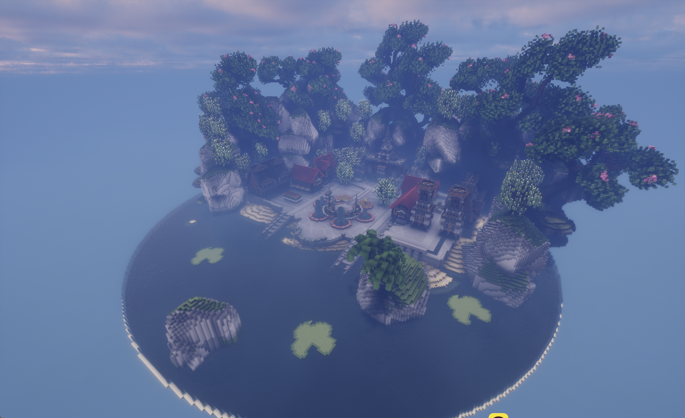

# 🌏 환영해요

지구 위에서 시작하는 또 하나의 일상, **Eartopia**에 오신 걸 환영해요!

Eartopia는 **1:500 크기의 지구 월드**에서 마을을 만들고 함께 생활하는 마인크래프트 서버예요. 물가에서 낚시를 즐기고, 직접 기른 작물로 요리하고, 여행지에서 만난 생물을 수첩에 기록해 보세요.

<figure><figcaption>
Eartopia 스폰 전경이에요. 화면의 색감은 그래픽 설정에 따라 달라질 수 있어요.
</figcaption></figure>

## 처음 오셨나요?

**[접속 방법](start/join.md) → [뉴비 필독](info/new-player.md) → [메인 메뉴](start/main-menu.md)** 순서로 읽어보세요. 처음부터 모든 명령어를 외우지 않아도 괜찮아요. `Shift+F`로 메뉴를 열면 자주 쓰는 기능을 찾을 수 있어요.

## Eartopia에서는 무엇을 하나요?

| 하고 싶은 일 | 여기부터 읽어보세요 |
| --- | --- |
| 함께 살 곳을 찾고 싶어요 | [마을](systems/towny.md) · [지구와 지도](systems/map.md) |
| 느긋하게 낚시하고 싶어요 | [낚시 시작하기](life/fishing.md) · [물고기 판매](life/fishing/selling.md) |
| 밭을 가꾸고 맛있는 음식을 만들래요 | [농사](life/farming.md) · [요리](life/cooking.md) |
| 여러 대륙을 여행하고 싶어요 | [탐사 수첩](life/wildlife.md) · [특산물과 교역](systems/trade.md) |
| 친구와 추억을 남기고 싶어요 | [친구](social/friends.md) · [엽서](social/postcards.md) · [사진](life/camera.md) |
| 내 취향을 표현하고 싶어요 | [꾸미기](life/cosmetics.md) · [그림](life/art.md) · [악기와 녹음](life/instruments.md) |

## 자주 찾는 곳

[공식 홈페이지](https://www.eartopia.net/) · [월드 지도](https://map.eartopia.net/) · [공식 디스코드](https://discord.gg/tymyqkCJW7)

플레이하다 막혔다면 [자주 묻는 질문](support/faq.md)과 [문제 해결](support/troubleshooting.md)을 확인해 주세요. 명령어만 빠르게 찾고 싶을 때는 [명령어 모음](support/commands.md)을 이용하면 돼요.
