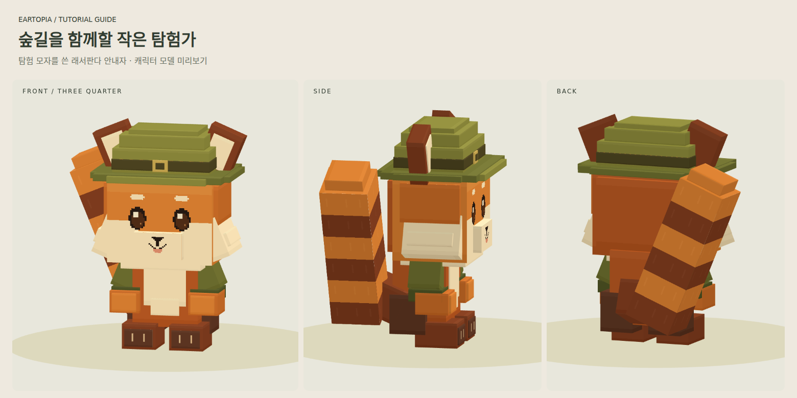

# 🌱 뉴비 필독

처음이라 어디로 가야 할지 모르겠다면 이 순서대로 시작해 보세요.

## 1. 리소스팩을 받아요

접속할 때 뜨는 **서버 리소스팩 안내를 수락**해 주세요. 전용 아이템과 메뉴가 보이려면 꼭 필요해요. 다운로드가 끝나고 화면이 돌아올 때까지 잠시 기다려 주세요.

이미 거절했다면 [리소스팩 설정](../start/resource-packs.md)을 따라 다시 적용할 수 있어요.

## 2. 래서판다 안내자를 따라가요

첫 접속에서는 래서판다 안내자가 Eartopia의 생활을 소개해 줘요.

| 조작 | 하는 일 |
| --- | --- |
| 우클릭 또는 웅크리기 | 다음 안내로 넘어가요. |
| 좌클릭 | 이전 단계로 돌아가요. |

장면을 조금 더 봐 달라는 안내가 나오면 잠시 기다린 뒤 눌러 주세요. 도중에 접속이 끊겨도 저장된 위치부터 이어 볼 수 있어요. 안내를 마치면 스폰으로 이동해요.

<figure><figcaption>
첫 여행을 함께할 래서판다예요. 게임에 사용하는 모델의 미리보기예요.
</figcaption></figure>

## 3. 메뉴를 열어봐요

**`Shift+F`**를 누르거나 나침반을 들고 우클릭해 보세요. 메인 메뉴에서 마을, 낚시, 친구, 스킬 수첩과 설정을 열 수 있어요.

키를 바꿔 쓰고 있다면 **웅크리기 + 보조 손과 아이템 맞바꾸기**를 누르면 돼요. 명령어 `/emainmenu`로도 열 수 있어요.

한국어로 표시하고 싶으면 `/language set ko_KR`을 입력해 주세요.

## 4. 오늘 할 일을 골라요

- **생활비를 마련할래요.** 낚싯대를 준비하고 [첫 물고기](../life/fishing.md)를 잡아보세요. 판매할 때는 `/fish sell`에서 물고기를 직접 고를 수 있어요.
- **함께 살 마을을 찾을래요.** `/town list`로 마을을 살펴보고 초대를 받아보세요. 가입한 뒤 `/town spawn`으로 마을에 갈 수 있어요.
- **탐험부터 해볼래요.** `/wildlife`에서 **이어지는 이야기**를 열어보세요. 첫 탐사 도구와 다음 목표를 안내해 줘요.

## 돌아오는 길도 기억해 주세요

시작 지점으로 돌아올 때는 `/spawn`을 사용해요. 전투 중이거나 다른 진행 화면에 들어가 있으면 이동이 제한될 수 있어요.


창고에 남길 물고기가 있다면 `/fish sell all`을 입력하기 전에 따로 보관해 주세요. 이 명령어는 팔 수 있는 물고기를 한 번에 판매해요.

