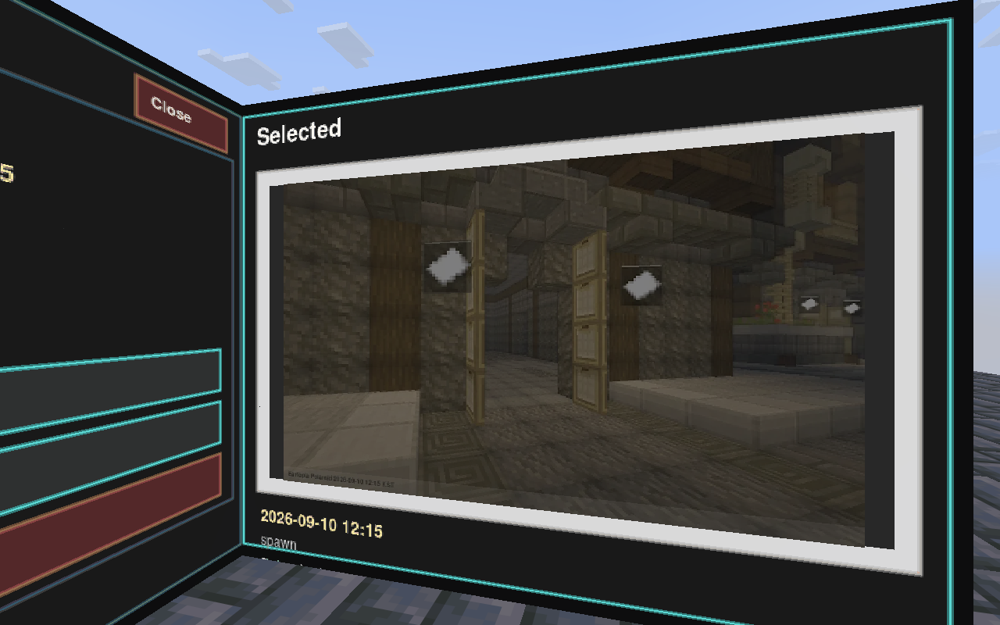

# 📷 사진과 앨범

Eartopia 카메라로 마음에 드는 장소를 찍어보세요. 찍은 사진은 게임 안 앨범과 홈페이지에서 다시 볼 수 있어요.

## 사진 찍기

**전용 카메라 아이템**을 손에 들고 원하는 곳을 바라본 뒤 우클릭해요. `/camera shoot`로도 촬영할 수 있어요.

촬영 중에는 같은 사진을 여러 번 요청하지 말고 완료 안내를 기다려 주세요. 일반 촬영에는 기본 **10초**의 재사용 대기 시간이 있어요.

## 앨범 열기

`/camera album`을 입력하고 사진을 선택해 보세요. 닫으려면 화면의 닫기 버튼이나 `/camera close`를 사용해요.

<figure><figcaption>
실제 게임에서 촬영한 앨범 화면이에요. 이 예시는 영어 설정으로 표시되어 있어요.
</figcaption></figure>

## 사진 활용하기

| 하고 싶은 일 | 방법 |
| --- | --- |
| 프로필 사진으로 쓰기 | 앨범의 사진 번호를 확인하고 `/camera profile <사진번호>` |
| 프로필 사진 해제하기 | `/camera profile clear` |
| 지도 아이템으로 인화하기 | `/camera print <사진번호>` |
| 웹에서 보고 저장하기 | [홈페이지 앨범](https://www.eartopia.net/album)에 로그인 |

사진 번호는 실제 내 앨범에 있는 값을 사용해 주세요. [내 프로필](../social/friends.md)의 최근 사진 목록에서 대표 사진을 고르는 방법도 있어요.

## 삼각대 사용하기

촬영할 방향을 바라본 뒤 `/camera tripod place`로 설치해요. `/camera tripod shoot`로 촬영하고, 사용이 끝나면 `/camera tripod remove`로 회수해요.

삼각대 촬영의 기본 재사용 대기 시간은 **20초**예요. 삼각대는 한 사람당 하나씩 사용할 수 있어요. 다시 설치하면 이전 삼각대는 새 위치로 옮겨져요.
