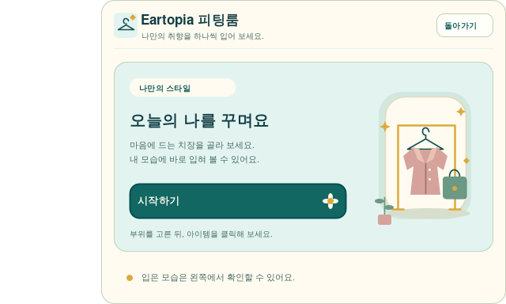

# ✨ 꾸미기

Eartopia에서는 **캐릭터 치장**과 **아이템 스킨**을 따로 고를 수 있어요. 보유한 꾸미기를 살펴보고 마음에 드는 조합을 찾아보세요.

## 피팅룸 들어가기

`/cosmetics`를 입력하면 피팅룸을 열 수 있어요. 시작하기를 누르고 부위와 아이템을 골라 내 모습에 적용해 보세요.

<figure><figcaption>
피팅룸 안내 패널의 미리보기예요. 게임에서는 피팅 공간과 함께 보여요.
</figcaption></figure>

피팅이 끝났다면 **돌아가기**를 누르거나 `/cosmetics exit`를 입력해 주세요. 피팅룸에서는 사용할 수 있는 행동과 명령어가 제한돼요.

## 아이템 스킨

`/skins`에서 아이템에 적용할 수 있는 스킨을 골라요. `/skin`도 같은 명령어예요.

캐릭터에 착용하는 장식과 아이템 외형은 서로 다른 목록이에요. 스킨마다 적용할 수 있는 아이템도 확인해 주세요.

## 이동 효과

`/particles`에서 이동 파티클을 선택할 수 있어요. 효과를 지우려면 `/particles clear`를 사용해요.

꾸미기는 보유 여부와 사용 권한에 따라 선택할 수 있어요. 목록에 보이는 모든 항목이 자동으로 지급되는 것은 아니에요.

## 내 보유 목록 확인하기

[홈페이지 스킨 페이지](https://www.eartopia.net/wiki/skins)에 로그인하면 보유 목록을 살펴볼 수 있어요. 게스트에게 비공개로 표시된다면 [홈페이지 로그인](../support/website.md)을 먼저 진행해 주세요.

외형이 보이지 않으면 [리소스팩](../start/resource-packs.md) 적용을 확인해 주세요.
