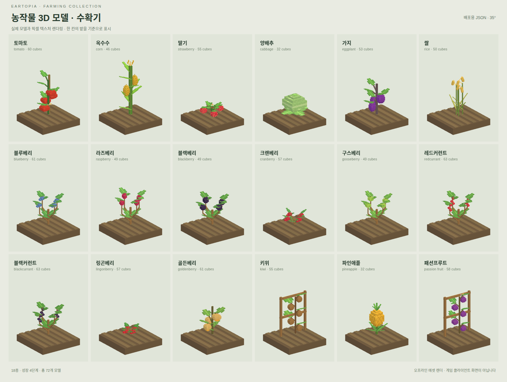

# 🌾 농사

토마토부터 파인애플까지, Eartopia의 작물로 밭을 채워보세요. 기본 작물 5종과 전용 작물 18종을 기를 수 있어요.

## 씨앗 심기

괭이로 경작지를 만들고 전용 씨앗을 들고 우클릭해요. 기본 작물은 원래 심는 방법을 따라요. 네더 와트는 영혼 모래에 심어 주세요.

작물은 **실제 경과 시간**에 맞춰 자라요. 가까이에서 바라보면 작물 이름과 남은 시간을 확인할 수 있어요.

<figure><figcaption>
전용 작물 18종의 수확기 모델 미리보기예요.
</figcaption></figure>

## 빨리 기르고 싶어요

뼛가루를 사용하면 남은 시간이 **한 번에 10분** 줄어요. 작물마다 자라는 시간이 다르니 [작물 목록](farming/crops.md)을 참고해 주세요.

## 수확하기

**수확 가능** 표시가 나온 작물을 캐면 수확물과 씨앗을 얻어요. 전용 작물을 다 자라기 전에 캐면 수확물 없이 씨앗만 돌아와요.

수확 뒤에는 씨앗을 다시 심어 다음 농사를 시작해 주세요. 다른 사람의 밭에서는 땅 사용 권한을 먼저 확인해요.

## 풍요 씨앗

성숙한 작물에서 나오는 씨앗은 각각 **5% 확률**로 풍요 씨앗이 될 수 있어요. 풍요 작물은 일반 작물보다 수확량이 **1.5~2배** 늘어요. 씨앗의 반짝임과 이름을 확인해 보세요.

밭에서 얻은 재료는 [요리](cooking.md)에도 사용할 수 있어요. 레시피가 요구하는 재료와 같은지 먼저 확인해 주세요.
