# 🐠 물고기 도감

`/fish index`에서 **내가 발견한 물고기와 남은 도감**을 확인해요. 웹에서는 [낚시 도감](https://www.eartopia.net/wiki/fishing)을 둘러볼 수 있어요.

현재 도감에는 잡동사니를 포함해 **65항목**이 있어요. 아래 그림은 게임 아이템에 쓰이는 원본 이미지예요. 등급 이름도 게임 도감에 표시되는 이름을 그대로 사용했어요.

## 원하는 물고기가 나오지 않아요

물 종류와 시간·날씨 조건, 장비의 최대 무게를 함께 확인해 주세요. 조건을 맞췄다고 매번 해당 물고기가 나오는 것은 아니에요. 낚시 스킬과 장비도 후보와 확률에 영향을 줘요.

물 종류는 실제 낚시 지역에 적용되는 규칙을 따라요. 지도에서 강이나 바다처럼 보이는지만으로 판단하기보다 게임 안내와 도감을 함께 확인해 주세요. 도감에 등록되어 있어도 해당 낚시 구역이 열려 있어야 잡을 수 있는 항목이 있어요.

## Junk · 2항목

| 모습 | 이름 | 물 종류 | 시간 · 날씨 |
| --- | --- | --- | --- |
| 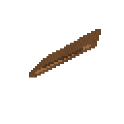 | 떠내려온 나무 | 제한 없음 | 항상 · 모든 날씨 |
| 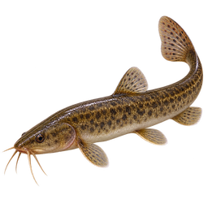 | 미꾸라지 | 제한 없음 | 항상 · 모든 날씨 |

## Abundant · 14항목

| 모습 | 이름 | 물 종류 | 시간 · 날씨 |
| --- | --- | --- | --- |
| 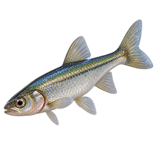 | 피라미 | 제한 없음 | 항상 · 모든 날씨 |
| 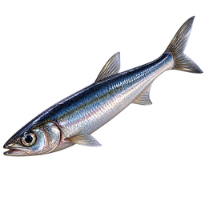 | 멸치 | 제한 없음 | 항상 · 모든 날씨 |
| 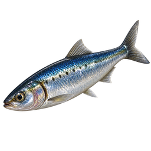 | 정어리 | 제한 없음 | 항상 · 모든 날씨 |
| 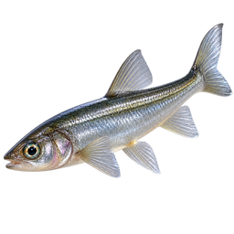 | 빙어 | 제한 없음 | 항상 · 모든 날씨 |
| 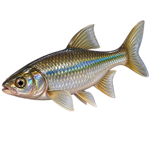 | 샤이너 | 제한 없음 | 항상 · 모든 날씨 |
| 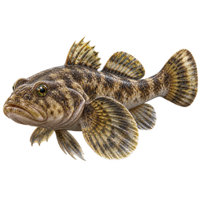 | 망둑어 | 제한 없음 | 항상 · 모든 날씨 |
| 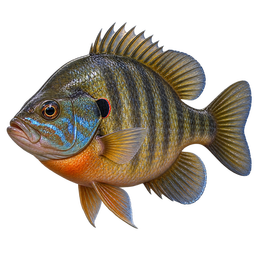 | 블루길 | 제한 없음 | 항상 · 모든 날씨 |
| 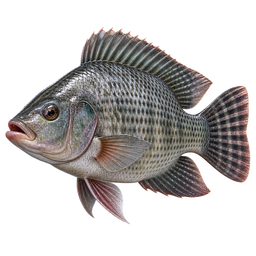 | 틸라피아 | 제한 없음 | 항상 · 모든 날씨 |
| 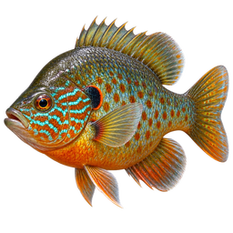 | 펌킨시드 | 제한 없음 | 항상 · 모든 날씨 |
| 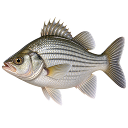 | 화이트 퍼치 | 제한 없음 | 항상 · 모든 날씨 |
| 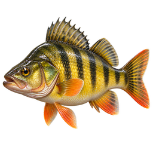 | 옐로 퍼치 | 제한 없음 | 항상 · 모든 날씨 |
| 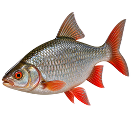 | 로치 | 제한 없음 | 항상 · 모든 날씨 |
| 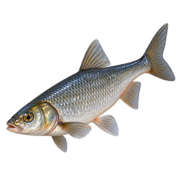 | 황어붙이 | 제한 없음 | 항상 · 모든 날씨 |
| 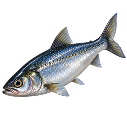 | 청어 | 제한 없음 | 항상 · 모든 날씨 |

## Common · 15항목

| 모습 | 이름 | 물 종류 | 시간 · 날씨 |
| --- | --- | --- | --- |
| 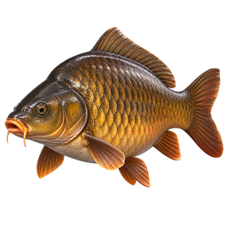 | 잉어 | 제한 없음 | 항상 · 모든 날씨 |
| 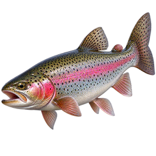 | 무지개송어 | 제한 없음 | 항상 · 모든 날씨 |
| 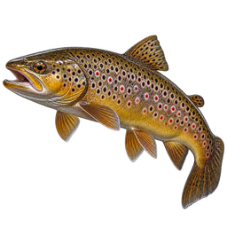 | 브라운 송어 | 제한 없음 | 항상 · 모든 날씨 |
| 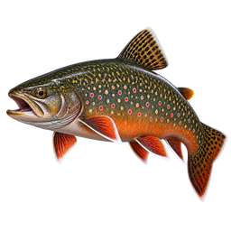 | 브룩 송어 | 제한 없음 | 항상 · 모든 날씨 |
| 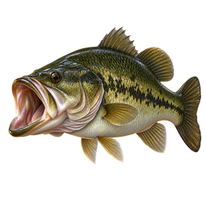 | 큰입배스 | 제한 없음 | 항상 · 모든 날씨 |
| 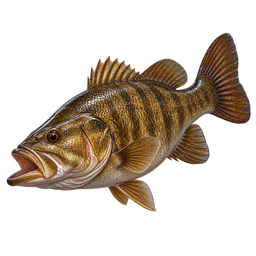 | 작은입배스 | 제한 없음 | 항상 · 모든 날씨 |
| 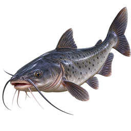 | 채널메기 | 제한 없음 | 항상 · 모든 날씨 |
| 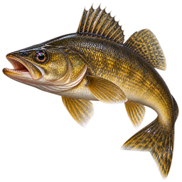 | 월아이 | 제한 없음 | 항상 · 모든 날씨 |
| 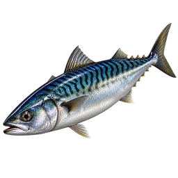 | 고등어 | 제한 없음 | 항상 · 모든 날씨 |
| 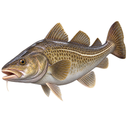 | 대구 | 제한 없음 | 항상 · 모든 날씨 |
| 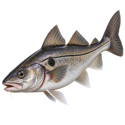 | 해덕 | 제한 없음 | 항상 · 모든 날씨 |
| 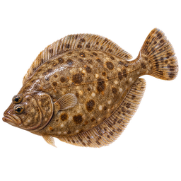 | 가자미 | 제한 없음 | 항상 · 모든 날씨 |
| 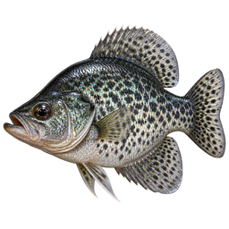 | 블랙 크래피 | 제한 없음 | 항상 · 모든 날씨 |
| 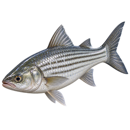 | 숭어 | 제한 없음 | 항상 · 모든 날씨 |
| 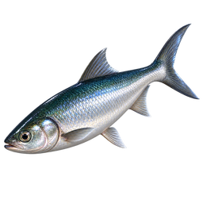 | 밀크피시 | 제한 없음 | 항상 · 모든 날씨 |

## Uncommon · 12항목

| 모습 | 이름 | 물 종류 | 시간 · 날씨 |
| --- | --- | --- | --- |
| 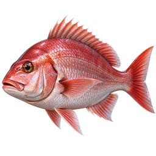 | 참돔 | 제한 없음 | 항상 · 모든 날씨 |
| 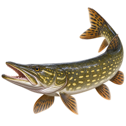 | 노던파이크 | 제한 없음 | 항상 · 모든 날씨 |
| 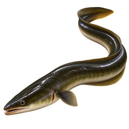 | 유럽뱀장어 | 제한 없음 | 밤 · 모든 날씨 |
| 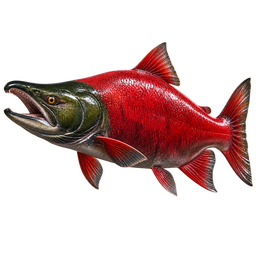 | 홍연어 | 제한 없음 | 항상 · 모든 날씨 |
| 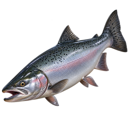 | 은연어 | 제한 없음 | 항상 · 모든 날씨 |
| 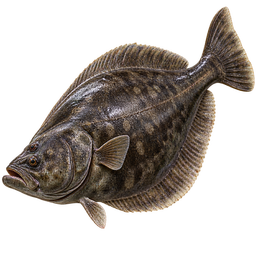 | 넙치 | 바닷물·차가운 물·깊은 바다 | 항상 · 모든 날씨 |
| 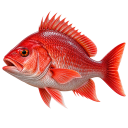 | 붉돔 | 제한 없음 | 항상 · 모든 날씨 |
| 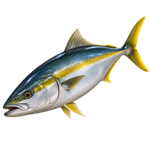 | 방어 | 제한 없음 | 항상 · 모든 날씨 |
| 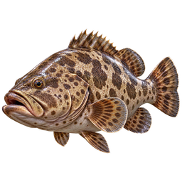 | 그루퍼 | 제한 없음 | 항상 · 모든 날씨 |
| 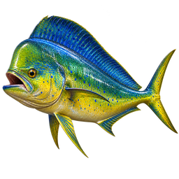 | 만새기 | 제한 없음 | 항상 · 모든 날씨 |
| 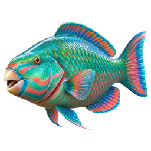 | 비늘돔 | 제한 없음 | 항상 · 모든 날씨 |
| 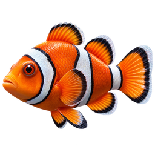 | 흰동가리 | 제한 없음 | 항상 · 모든 날씨 |

## Rare · 9항목

| 모습 | 이름 | 물 종류 | 시간 · 날씨 |
| --- | --- | --- | --- |
| 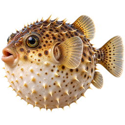 | 복어 | 제한 없음 | 항상 · 모든 날씨 |
| 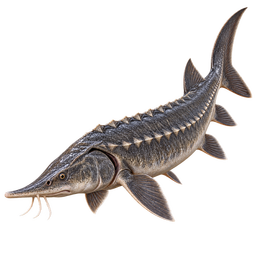 | 철갑상어 | 민물·깊은 바다 | 항상 · 모든 날씨 |
| 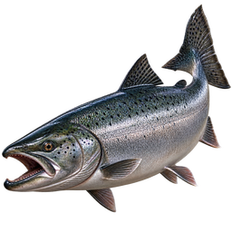 | 왕연어 | 제한 없음 | 항상 · 모든 날씨 |
| 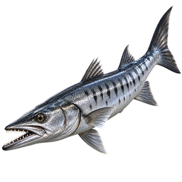 | 바라쿠다 | 제한 없음 | 항상 · 모든 날씨 |
| 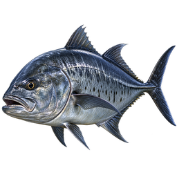 | 무명갈전갱이 | 제한 없음 | 항상 · 모든 날씨 |
| 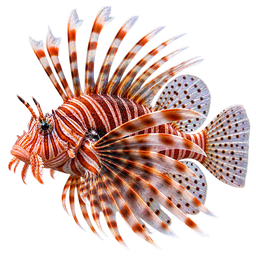 | 쏠배감펭 | 제한 없음 | 항상 · 모든 날씨 |
| 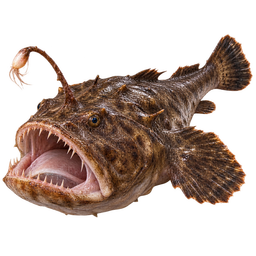 | 아귀 | 바닷물·깊은 바다 | 항상 · 모든 날씨 |
|  | 피라루쿠 | 제한 없음 | 항상 · 모든 날씨 |
|  | 청새치 | 바닷물·깊은 바다 | 항상 · 모든 날씨 |

## Epic · 3항목

| 모습 | 이름 | 물 종류 | 시간 · 날씨 |
| --- | --- | --- | --- |
|  | 별빛 비단잉어 | 제한 없음 | 밤 · 모든 날씨 |
|  | 주름상어 | 깊은 바다 | 밤 · 모든 날씨 |
|  | 실러캔스 | 깊은 바다 | 항상 · 모든 날씨 |

## Legendary · 2항목

| 모습 | 이름 | 물 종류 | 시간 · 날씨 |
| --- | --- | --- | --- |
|  | 심연 참치 | 깊은 바다 | 항상 · 모든 날씨 |
|  | 산갈치 | 깊은 바다 | 항상 · 비·눈 |

## Mythic · 2항목

| 모습 | 이름 | 물 종류 | 시간 · 날씨 |
| --- | --- | --- | --- |
|  | 고대 비늘 | 유적 | 항상 · 모든 날씨 |
|  | 화석 가아 | 유적 | 항상 · 모든 날씨 |

## Ancient · 2항목

| 모습 | 이름 | 물 종류 | 시간 · 날씨 |
| --- | --- | --- | --- |
|  | 오로라 가오리 | 차가운 물·깊은 바다 | 항상 · 맑음 |
|  | 빙하 만타 | 차가운 물·깊은 바다 | 항상 · 맑음 |

## Secret · 2항목

| 모습 | 이름 | 물 종류 | 시간 · 날씨 |
| --- | --- | --- | --- |
|  | 공허지느러미 | 유적·깊은 바다 | 밤 · 모든 날씨 |
|  | 달장막 아귀 | 유적·깊은 바다 | 밤 · 모든 날씨 |

## Apex · 2항목

| 모습 | 이름 | 물 종류 | 시간 · 날씨 |
| --- | --- | --- | --- |
|  | 가라앉은 왕관고기 | 유적·깊은 바다 | 밤 · 비·눈 |
|  | 별을 삼키는 레비아탄 | 유적·깊은 바다 | 밤 · 비·눈 |

잡은 물고기를 정리하고 싶다면 [판매 안내](selling.md)를 읽어보세요. 수집해 둘 물고기는 판매 전에 따로 보관해 주세요.
