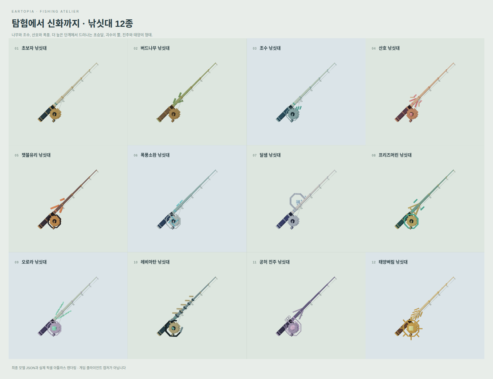

# 🪝 낚시 장비

낚시 장비는 **낚싯대·낚싯줄·찌·마법**으로 나뉘어요. `/fish shop`에서 구매하고 `/fish gear`에서 보유 장비를 장착할 수 있어요.

<figure><figcaption>
낚싯대 12종의 모델 미리보기예요. 장비를 고를 때는 외형과 능력치를 함께 살펴보세요.
</figcaption></figure>

## 무엇부터 바꾸면 좋을까요?

| 능력치 | 살펴볼 때 |
| --- | --- |
| 행운 | 희귀한 물고기와 변이를 노리고 싶을 때 |
| 힘 | 물고기의 움직임과 진행도 손실이 버거울 때 |
| 숙련 | 미니게임의 조작 영역을 더 편하게 다루고 싶을 때 |
| 입질 | 물고기를 기다리는 시간을 줄이고 싶을 때 |
| 거물 확률 | 더 큰 물고기를 노리고 싶을 때 |
| 최대 무게 | 무거운 물고기를 낚을 준비를 할 때 |

행운만 높인다고 모든 물고기를 바로 잡을 수 있는 것은 아니에요. 낚시 지역, 시간·날씨 조건과 최대 무게도 함께 맞아야 해요.

## 장비 종류

현재 낚싯대 **12종**, 낚싯줄 **10종**, 찌 **10종**, 마법 없음 항목을 포함한 마법 **12종**이 있어요.

처음에는 초보자 낚싯대, 면 낚싯줄, 코르크 찌를 기준으로 시작해요. 구매 전에 상점의 가격과 능력치를 읽고, 구매한 뒤에는 장비 화면에서 실제 장착 상태도 확인해 주세요.

## 장비를 바꿨는데 모양이 이상해요

전용 외형은 [리소스팩](../../start/resource-packs.md)이 필요해요. 팩 적용이 끝난 뒤 낚싯대를 다시 들어보세요.
