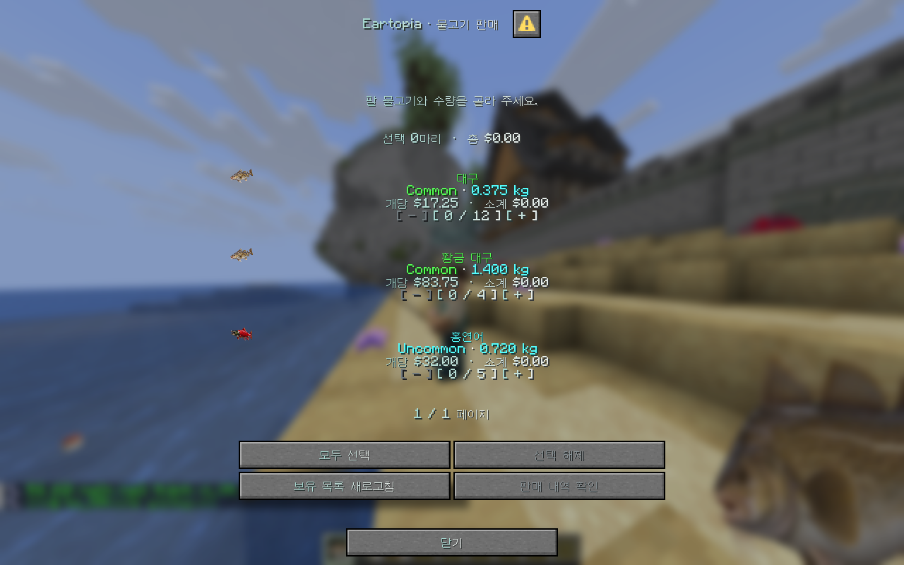
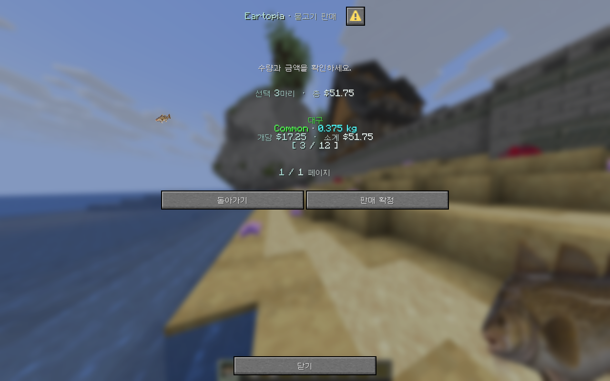

# 🐟 물고기 판매

`/fish sell`을 입력하면 **판매할 물고기와 수량을 고르는 화면**이 열려요. 낚시 메뉴의 판매 버튼이나 마일로의 **판매** 선택지에서도 열 수 있어요.

<figure><figcaption>
실제 게임 클라이언트로 촬영한 판매 화면이에요. 표시된 물고기, 수량과 가격은 예시예요.
</figcaption></figure>

## 골라서 판매하기

1. `+`와 `−`로 팔 수량을 정해요. 수량 표시를 누르면 해당 묶음 전체를 선택하거나 해제할 수 있어요.
2. 물고기가 많으면 다음 페이지도 살펴봐요.
3. **판매 내역 확인**을 눌러 수량과 총액을 확인해요.
4. 맞다면 **판매 확정**을 눌러요.

<figure><figcaption>
확정하기 전에 선택한 물고기만 다시 보여줘요.
</figcaption></figure>

잘못 골랐다면 돌아가서 수정하거나 닫으면 돼요. 판매 화면을 연 뒤 인벤토리를 바꿨다면 **보유 목록 새로고침**을 눌러 다시 확인해 주세요.

## 바로 판매하는 명령어

| 명령어 | 판매 범위 |
| --- | --- |
| `/fish sell hand` | 손에 든 판매 가능한 물고기 묶음 |
| `/fish sell all` | 인벤토리에 있는 판매 가능한 물고기 전체 |


두 명령어는 선택 화면을 거치지 않고 바로 판매해요. 보관할 물고기가 있다면 먼저 다른 곳에 넣어 주세요.


## 같은 물고기인데 가격이 달라요

종류뿐 아니라 **무게, 변이와 잡을 때의 보너스**에 따라 가치가 달라져요. 반짝이는 변이는 1.8배, 황금은 3배, 별빛은 8배의 가치 배율이 적용돼요.

최종 판매 금액은 판매 화면에서 확인해 주세요. 거래 결과가 이상하다면 바로 반복 판매하기보다 안내 메시지를 남겨 문의해 주세요.
