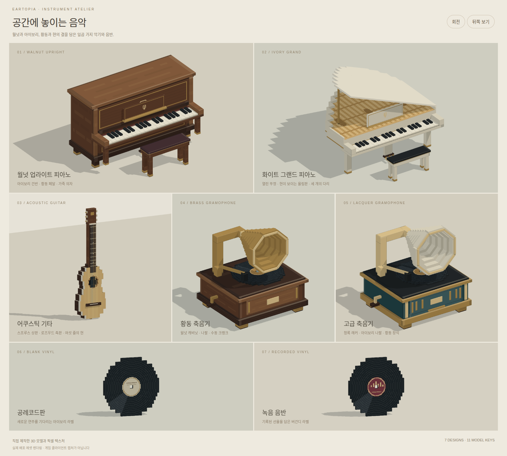

# 🎹 악기와 녹음

피아노와 기타로 Eartopia 안에서 연주해 보세요. 컴퓨터 키보드나 MIDI 장치의 입력을 게임 속 악기로 보낼 수 있어요.

<figure><figcaption>
게임에서 사용하는 악기와 음반의 모델 미리보기예요.
</figcaption></figure>

## 연주 준비하기

1. 설치된 피아노를 우클릭해서 앉거나, 전용 기타를 손에 들어요.
2. [웹 연주 페이지](https://www.eartopia.net/instruments)를 열어요.
3. 게임에 접속 중인 닉네임으로 [로그인](../support/website.md)해요.
4. 연결 상태를 확인하고 화면의 건반이나 키보드로 연주해요.

다른 사람이 사용 중인 피아노에는 동시에 앉을 수 없어요. MIDI 장치를 쓰려면 브라우저의 장치 접근 안내도 확인해 주세요.

## 축음기로 녹음하기

축음기를 우클릭하면 녹음을 시작해요. 녹음 반경과 시간 제한이 안내되니 가까이에서 연주해 주세요.

같은 축음기를 다시 우클릭하면 녹음을 마치고 저장해요. 녹음을 시작한 사람만 진행 중인 녹음을 조작할 수 있어요.

## 녹음 듣고 음반 만들기

`/einstruments recordings`를 입력하면 내 녹음 목록이 열려요. 원하는 녹음을 골라 **재생**으로 미리 들어보세요.

음반을 만들려면 **빈 레코드판**을 손에 들고 **추출**을 눌러요. 채팅 안내에 따라 제목, 설명과 공개 범위를 정하면 돼요. 공개 범위는 모두 또는 친구 중에서 골라요.

일반 음악 음반 대신 전용 빈 레코드판이 필요해요. [그림](art.md)을 넣은 레코드판은 표지로도 활용할 수 있어요.

## 주크박스에서 재생하기

완성된 음반으로 주크박스를 우클릭하면 반복 재생돼요. 재생 중인 주크박스를 다시 우클릭하면 들어 있는 음반을 꺼낼 수 있어요.

한 주크박스에는 한 장만 넣을 수 있어요. 새 음반을 넣기 전에 기존 음반을 먼저 꺼내 주세요.
