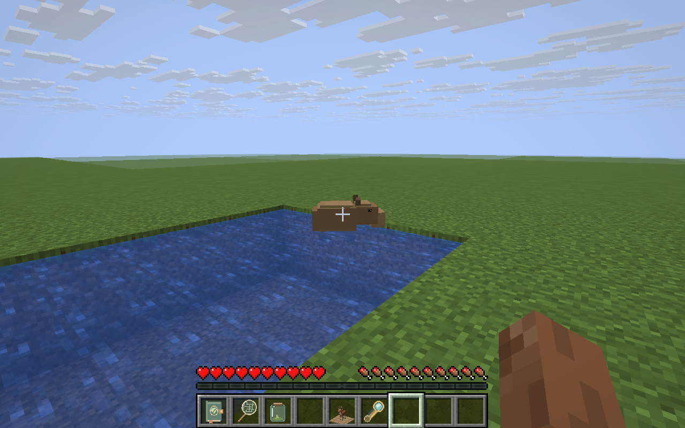
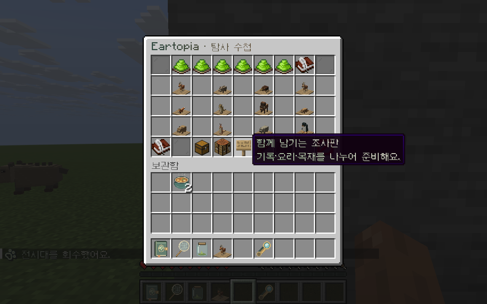

# 🔎 탐사 수첩

지구 곳곳의 생물을 만나고 **발견·행동·서식 흔적**을 모아보세요. 사냥하지 않고 관찰과 요리만으로도 첫 이야기를 완성할 수 있어요.

## 첫 탐사 시작하기

`/wildlife`를 입력하고 **이어지는 이야기**를 열어 조사원 윤을 만나세요. 첫 장을 시작하면 필요한 도구와 목표를 안내해 줘요.

도구를 잃어버렸다면 수첩의 **탐사 도구 찾기**를 확인해 주세요.

## 세 가지 기록 남기기

| 기록 | 하는 방법 |
| --- | --- |
| 첫 발견 | 수첩을 들고 생물을 바라본 뒤 우클릭해요. 시선을 유지해 주세요. |
| 대표 행동 | 풀을 뜯거나 헤엄치는 등 수첩에 적힌 행동을 기다렸다가 관찰해요. |
| 서식 흔적 | 근처의 해당 지형을 수첩·렌즈로 웅크려 우클릭해요. |

너무 가까이 달려가면 생물이 놀라 도망갈 수 있어요. 거리를 두고 천천히 다가가 보세요. 도구를 들고 좌클릭하면 수첩을 다시 열 수 있어요.

<figure><figcaption>
테스트 월드에서 촬영한 카피바라예요. 물가에서 쉬거나 헤엄치는 모습을 관찰해 보세요.
</figcaption></figure>

## 어디서 만날 수 있나요?

| 대륙 | 생물 |
| --- | --- |
| 아시아 | 꽃사슴, 멧돼지, 장수풍뎅이 |
| 유럽 | 붉은사슴, 붉은여우 |
| 아프리카 | 미어캣 |
| 북아메리카 | 아메리카들소, 아메리카비버 |
| 남아메리카 | 카피바라 |
| 오세아니아 | 붉은캥거루, 커먼웜뱃 |
| 남극 | 아델리펭귄 |

같은 대륙이어도 생물마다 선호하는 지형이 달라요. 수첩의 **서식지 찾아가기**에서 힌트를 읽고 **마을 밖 자연 지형**을 찾아보세요.

## 탐사 후에는 따뜻한 한 끼

기록을 채우고 **보상 받기**를 눌러요. 요리사 보리의 안내에 따라 [들녘 채소 수프](cooking.md)를 직접 만들고 먹어보세요.

야외 식사 효과가 남아 있을 때 다시 관찰하면 다음 이야기로 이어져요. 이후 **채소 수프 1개와 일반 판자 4개**를 준비해 기록관 노아를 만나면 개인 전시를 만들 수 있어요.

## 함께 조사하기

개인 전시와 필요한 기록을 완성했다면 공동 조사도 시작할 수 있어요. **완성한 생물 기록, 채소 수프 2개, 일반 판자 8개**를 나누어 준비해요.

<figure><figcaption>
게임에서 촬영한 탐사 수첩과 공동 조사 버튼이에요. 진행도에 따라 사용할 수 있는 항목이 달라져요.
</figcaption></figure>

같은 시간에 접속하지 않아도 조사판에 기여한 기록을 남길 수 있어요. 곤충 채집이나 사냥 재료가 궁금하면 수첩의 해당 이야기에서 조건을 확인해 주세요.
