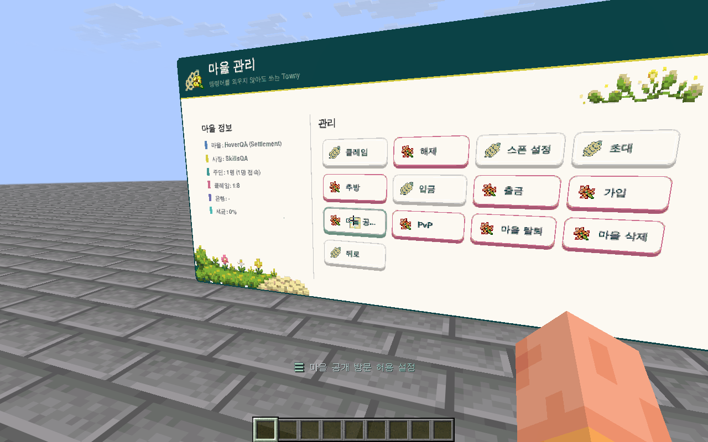

# 🧭 메인 메뉴

**`Shift+F`**를 누르면 내 메뉴가 열려요. 나침반을 들고 우클릭하거나 `/emainmenu`를 입력해도 돼요.

메뉴의 버튼을 바라보고 클릭해 주세요. 버튼 위에 시선을 두면 어떤 기능인지 안내가 나와요.

## 메뉴에서 할 수 있는 일

| 메뉴 | 하는 일 |
| --- | --- |
| 스폰 | 처음 시작한 장소로 돌아가요. |
| 마을·국가 | 내 소속, 마을 목록, 초대와 관리 기능을 확인해요. |
| 낚시 | 장비, 도감과 판매 화면을 열어요. |
| 꾸미기 | 피팅룸과 아이템 스킨을 찾아요. |
| 친구 | 친구 목록과 신청을 확인해요. |
| 스킬 수첩 | 생활·전투 스킬의 성장과 효과를 살펴봐요. |
| 설정 | 배경음악, 저사양 모드와 표시 언어를 바꿔요. |

내 프로필과 엽서함도 메뉴에서 열 수 있어요. 버튼이 잠겨 있다면 현재 소속이나 권한으로 사용할 수 없는 기능이에요.

<figure><figcaption>
메뉴 안의 마을 관리 화면이에요. 테스트 환경에서 촬영했으며, 마을 정보와 사용할 수 있는 버튼은 플레이어마다 달라요.
</figcaption></figure>

## 메뉴가 잘 안 눌려요

화면은 보이는데 클릭 위치가 어긋나면 [패널 커서 보정](../support/panel-cursor-calibration.md)을 해보세요. 화면 자체가 보이지 않으면 [리소스팩](resource-packs.md)을 먼저 확인해 주세요.
