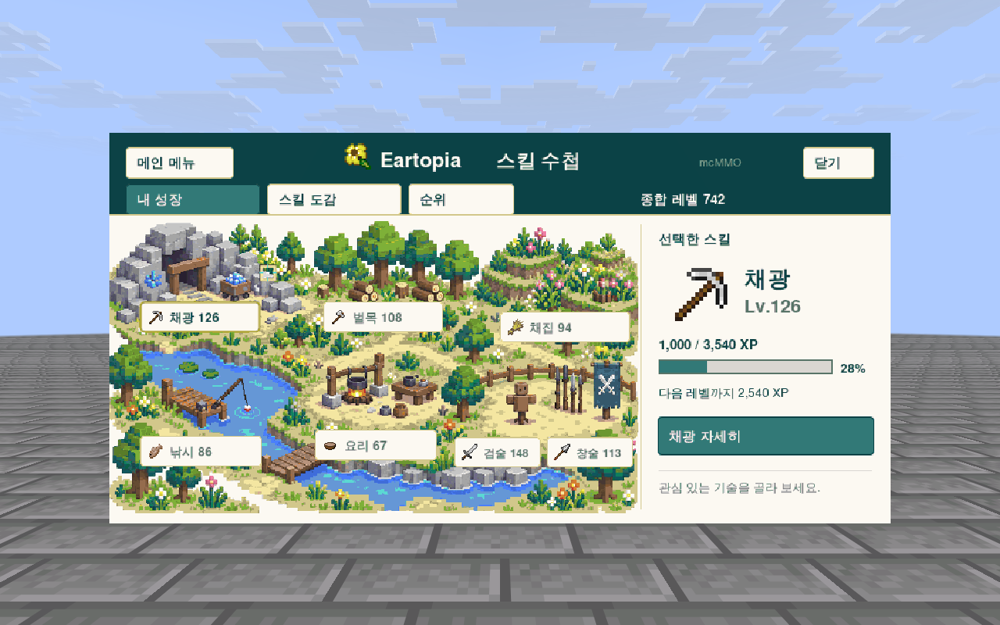

# 📖 스킬 수첩

채광하고, 낚시하고, 요리하면서 쌓인 성장을 한눈에 볼 수 있어요. **메인 메뉴 → 스킬 수첩** 또는 `/eskills`로 열어보세요.

<figure><figcaption>
게임에서 촬영한 스킬 수첩이에요. 레벨과 경험치는 테스트용 예시예요.
</figcaption></figure>

## 일곱 가지 스킬

| 스킬 | 성장하는 활동 |
| --- | --- |
| 채광 | 경험치 대상인 자연석과 광물 캐기 |
| 벌목 | 경험치 대상인 나무 베기 |
| 채집 | 경험치 대상인 작물과 식물 수확하기 |
| 낚시 | Eartopia 낚시에 성공하기 |
| 요리 | 경험치 대상 요리를 완성해서 받기 |
| 검술 | 검으로 경험치 대상 몬스터와 싸우기 |
| 창술 | 창으로 경험치 대상 몬스터와 싸우기 |

직접 설치한 블록이나 보호 구역의 대상은 경험치 규칙이 다를 수 있어요. 같은 행동을 반복했는데 경험치가 오르지 않으면 수첩의 **성장 방법**을 확인해 보세요.

## 수첩 읽는 법

**내 성장**에서 스킬을 고르면 현재 레벨과 다음 레벨까지 필요한 경험치를 볼 수 있어요. 자세히 보기에서는 효과와 성장 방법을 확인할 수 있어요.

**스킬 도감**은 여러 스킬을 비교할 때, **순위**는 다른 플레이어의 성장을 살펴볼 때 이용해 보세요.

Eartopia 낚시와 농사에는 각각의 규칙이 적용돼요. 다른 서버의 같은 이름 스킬과 효과가 모두 같지는 않으니 수첩의 설명을 기준으로 확인해 주세요.
