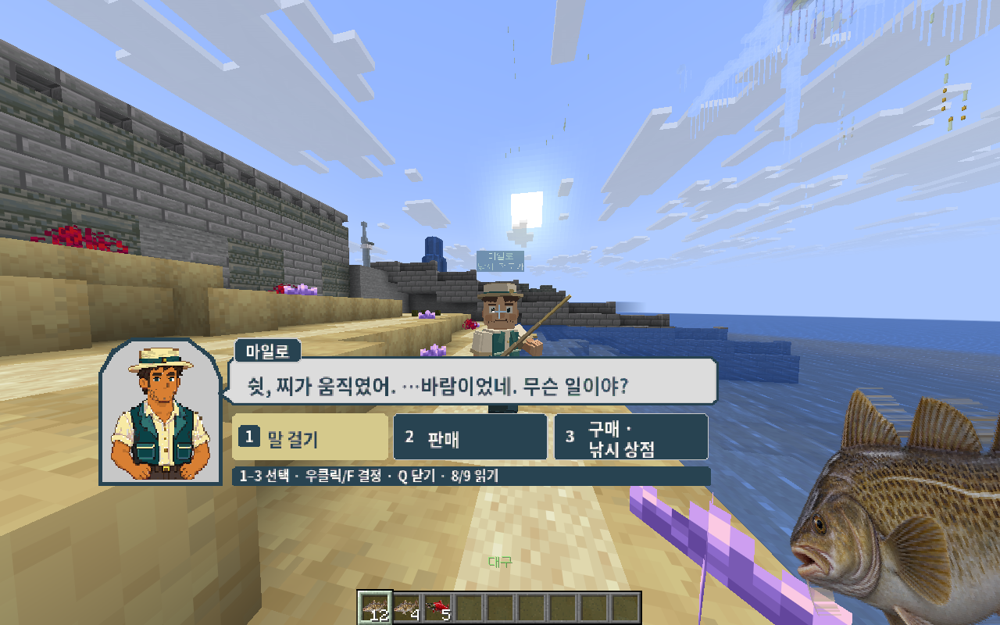

# 🌳 스폰

스폰은 Eartopia에 처음 도착하는 장소예요. 튜토리얼을 마친 뒤 이곳에서 여행을 시작해요.

<figure><figcaption>
스폰 전경이에요. 건물과 길을 따라 천천히 둘러보세요.
</figcaption></figure>

## 돌아오기

`/spawn` 또는 `/스폰`을 입력하면 스폰으로 이동해요. 메인 메뉴의 **스폰** 버튼을 눌러도 돼요.

이동 연출이나 목적지 준비 안내가 나오면 잠시 기다려 주세요. 전투 중에는 스폰 이동이 제한될 수 있어요.

## 스폰에서 할 수 없는 일

스폰의 건축물과 장식은 보호되어 있어요. 일반 플레이어는 블록을 마음대로 설치하거나 부술 수 없어요. 밭을 만들거나 집을 지으려면 [마을](towny.md)에서 사용할 땅부터 마련해 주세요.

## 낚시꾼 마일로

마일로를 만나면 우클릭해서 대화를 시작해 보세요. 대화 선택지에서 낚시 상점과 물고기 판매 화면을 열 수 있어요.

<figure><figcaption>
실제 게임 클라이언트로 촬영한 마일로 대화 예시예요.
</figcaption></figure>

선택지는 화면 아래에 표시된 키 안내를 따라 고르면 돼요. 물고기를 파는 방법은 [판매 안내](../life/fishing/selling.md)에 정리되어 있어요.
